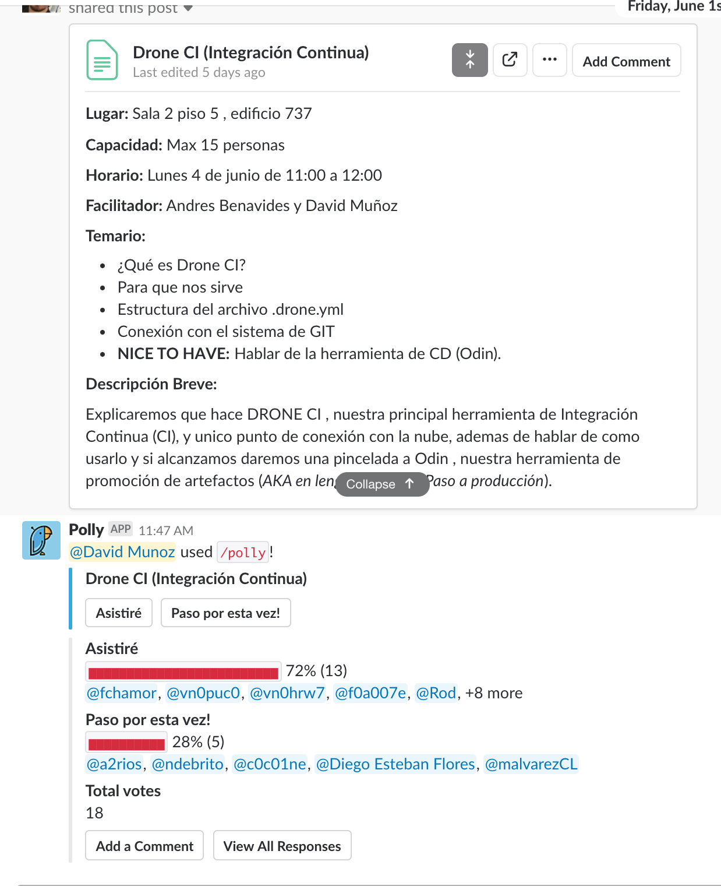

## Comunidades Digitales

Las comunidades son espacios colaborativos que tienen como objetivo compartir el conocimiento y vivencias de nuestro día a día en Walmart Digital, o aportar con ideas frescas que nos permitan entregar un mejor valor hacia nuestros clientes y aprender de ello en el proceso.

Para crear una comunidad basta con tener ganas y ser responsable de incentivar los objetivos que se buscan con ella.

Sin perjuicio de lo anterior, dejamos una lista con lo que nos parece debe ser el mínimo aceptable para la generación de una comunidad.

- Que exista un **objetivo claro y especifico** común entre los participantes que conformaran la comunidad.
- Que se defina un **espacio físico disponible al menos una vez por semana** donde se junten para conversar los temas pertinentes a la comunidad.
- Que exista una **persona encargada (o pareja de la semana)** que ordene y organice las reuniones de la comunidad para que sea una **reunión ordenada y directo al punto**.
- Que exista un **facilitado**r que dirija la comunidad, alineando a los equipos reunidos, para que puedan hacer un **uso efectivo del tiempo** en el cual se reúnen.
- Que la reunión de la comunidad física dure como **máximo 1 hora en honor a los actores que la conforman** (*por ello la importancia de un facilitador*).
- Que sea un **ambiente seguro** donde cada uno pueda aportar y nutrir a los equipos con información efectiva que nos permita mejorar nuestros procesos o cultura.
- Que la comunidad sea efectiva y cuando no , ya sea porque cumplió el objetivo o no era lo esperado, se elimine para dar cabida a otras comunidades y así hacer uso efectivo de nuestro tiempo
- Que las **comunidades sean opcionales** y **libres a quienes puedan y quieran participar**.
- Que nos **divirtamos** en el proceso


## Herramientas de Apoyo a las Comunidades

Para una colaboración efectiva del conocimiento las comunidades dispondrán a los involucrados las herramientas que permitan optimizar la entrega de información o espacios de colaboración e interacción entre los participantes.

Algunas herramientas populares para el día a día de una comunidad son:

### Canal de Slack
<p align="center">
 
</p>
Cada comunidad en general tendrá un canal asociado a esté que permitirá comunicar las interacciones entre los equipos , así como también generar un flujo de información constante y efectiva que nos permita lograr el objetivo claro y especifico que la comunidad persigue.

Las normas de conducta de los canales en general son las siguientes:

- Que la información que se comunique por los canales de cada comunidad, persiga el objetivo de brindar **información efectiva sobre la comunidad**, siendo consciente de que lo que queremos entregar es **información eficiente y efectiva para los participantes de la comunidad**, y que no se transforme en un *"chat más"*.

- Que sea un **ambiente seguro** donde cada mensaje cuenta (de acuerdo previamente de lo anterior)

- Todo participante debe y puede ser moderador del canal **ayudando a que el canal se mantenga limpio y enfocado en el objetivo de la comunidad**.

- Ser participantes **conscientes con la información compartida**, esto significa que los contenidos compartidos a todos los participados estén **validados y comprobados** (*[curated content](https://es.wikipedia.org/wiki/Curaci%C3%B3n_de_contenidos#Curaci%C3%B3n_de_contenidos_educativos)*)


### Charlas de Conocimientos
<p align="center">
 
</p>

Cuando un tema es interesante para los participantes y se requiere ahondar más en los temas expuestos, es súper útil generar charlas de no más de 1 hora donde las personas que tienen el conocimiento (*champions*) lo puedan exponer al resto de los participantes para que todos podamos mejorar y aprender.

Algunas recomendaciones que pueden usar para generar charlas efectivas pueden ser:

- Que la charla no se alargue más de una hora (1:15 máximo)

- Para que lo anterior sea efectivo, restringir la participación no supere un máximo de 15 personas para que todos puedan resolver sus dudas y que los charlistas puedan entregar el conocimiento de forma efectivo.

- Si la charla se necesita hacer de nuevo, es válido y la idea es que sea solicitada por las personas que desean repetirla o los que deseen participar de nuevo.

- Publicar la charla en el canal #charlas_comunidades generando un mensaje tipo [POST](https://get.slack.help/hc/en-us/articles/203950418-Compose-a-post) de slack indicando al menos:
   - **Lugar**: Espacio físico donde se realizará.
   - **Capacidad**: Capacidad máxima de la sala.
   - **Horario**: Fecha y lugar donde se realizará la charla
   - **Relator**: Persona(s) encargadas de dar la charla
   - Temario: Lista de temas específicos que se abordaran en la charla.
   - **Descripción breve**: breve descripción y general de lo que se verá la charla.

Luego de realizado el POST de slack , generar una encuesta con la app polly para la generación de un formulario de inscripción

```shell
/polly "{Nombre de la Charla} (Capacidad: {Capacidad Máxima})" "Asistiré", "Paso por esta vez"
```

<p align="center">
 
 <br />
 <span>Ejemplo de un post y formulario de registros de una charla</span>
</p>

 <br />

> ¿Quieres contribuir con el contenido de Walmart Digital?
conoce más [haciendo clic aquí](/es/how-to-contribute.md)

